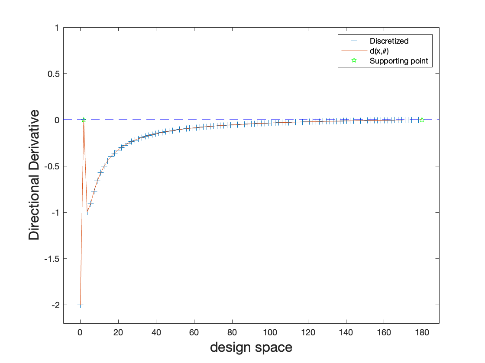
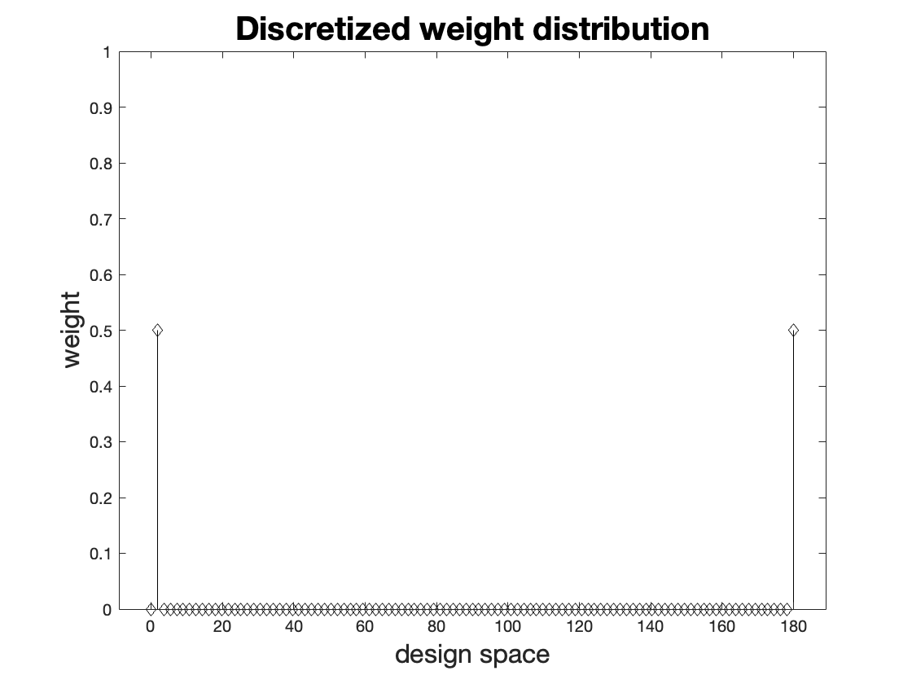

# optDesign: A MATLAB toolbox to compute optimal regression designs

*[Chi-Kuang Yeh](https://chikuang.github.io/), [Julie Zhou](https://www.uvic.ca/science/math-statistics/people/home/faculty/zhou_julie.php)*

*May 08, 2024*

[](https://shields.io/)

[**Home**](https://optDesign.readthedocs.io/)
| [**Description**](#description)
| [**Status**](#status)
| [**Example**](#example)
| [**TODO**](#todo)
| [**Reference**](#reference)

---

## Description

A MATLAB toolbox to compute *optimal regression designs*. 

Consider a general regression model,
$$y_i=\eta(\mathbf{x}_i, \mathbf{\theta})+ \epsilon_i, \quad i=1, \ldots, n,$$
where $y_i$ is the $i$-th observation of a response variable $y$ at design point
$\mathbf{x}_i \in S \subset \mathbb{R}^p$, $S$ is a design space,
$\mathbf{\theta} \in \mathbb{R}^q$ is the unknown regression parameter vector,
response function $\eta(\mathbf{x}_i, \mathbf{\theta})$   can be a linear or nonlinear
function of $\mathbf{\theta}$, and the errors $\epsilon_i$ are assumed to be uncorrelated with mean zero and finite variance $\sigma^2$.

Let $\hat{\mathbf{\theta}}$ be an estimator of $\mathbf{\theta}$, such as the least squares estimator. Various optimal designs are defined by minimizing $\phi\left\( \mathbb{c}ov(\hat{\mathbf{\theta}}) \right\)$ over the design points
$\mathbf{x}_1, \ldots, \mathbf{x}_n$, where function $\phi(\cdot)$  can be determinant, trace, or other scalar functions. The resulting designs are called optimal exact designs (OEDs), which depend on the response function $\eta(\cdot,\cdot)$, the design space $S$, the estimator $\hat{\mathbf{\theta}}$, the scalar function $\phi(\cdot)$, and the number of points $n$.

## Status

Currently, this toolbox is under development. I will update it whenever I have leisure time.

## Installation

##### 1. Download

From a command line:

```
git clone https://github.com/chikuang/optDesign
```
##### 2. Install in MATLAB
From a MATLAB command window: 
```
addpath( genpath('AbsolutePathToToolbox') )
```
where `AbsolutePathToToolbox` is the name of the absolute path where you cloned this toolbox. 
Adding this command to your MATLAB `startup.m` file will make sure these tools are available every time you
use MATLAB.

## Example


##### Example 1. Optimal approximate design under ordinary least-squares estimator

The information matrix of a design $\xi(\mathbf{x})\in \Xi_S$ for model on top is given by
```math
\boldsymbol{\mathrm{I}}(\xi, \mathbf{\theta}^*) =\sum_{i=1}^k w_i \boldsymbol{\mathrm{f}}({\bf v}_i, \mathbf{\theta}^*)\boldsymbol{\mathrm{f}}^\top({\bf v}_i, \mathbf{\theta}^*),
```
where vector $`\boldsymbol{\mathrm{f}}(\mathbf{x}, \mathbf{\theta}) =\frac{\partial \eta(\mathbf{x}, \mathbf{\theta})}
{\partial  \mathbf{\theta}}`$, and $`\mathbf{\theta}^*$` is the true value of $`\mathbf{\theta}`$. The covariance matrix of $`\hat{\mathbf{\theta}}`$, $`\mathbb{c}ov(\hat{\mathbf{\theta}})`$, is proportional to $`\boldsymbol{\mathrm{I}}^{-1}(\xi, \mathbf{\theta}^*)`$. An OAD is defined as the minimizer of  $`\phi\left\{  \boldsymbol{\mathrm{I}}^{-1}(\xi, \mathbf{\theta}^*)\right\}`$ over all possible designs  $`\xi \in \Xi_S`$ for a given function $`\phi(\cdot)`$. 

```
[optval, opt_design] = opt_OLS("D", 1001, [0, 4], [1,1]', @mm)
```

Results are as follows:
``` matlab
Optimal value (cvx_optval): +2.74887
opt_val =
    2.7489
opt_design =
    0.6680    4.0000
    0.5000    0.5000
```

##### Example 2. Optimal approximate design under second least-squares estimator

Second order least-squares estimator is defined as
```math
(\boldsymbol{\hat{\theta}}^\top,\hat{\sigma}^2)^\top:=\underset{\boldsymbol{\theta},\sigma^2}{\mathrm{argmin}}\sum_{i=1}^n \begin{pmatrix}
y_i-\eta(\boldsymbol{x}_i;\boldsymbol{\theta})\\
y_i^2-\eta^2(\boldsymbol{x}_i;\boldsymbol{\theta})-\sigma^2
\end{pmatrix}^\top W(\boldsymbol{x_i}) \begin{pmatrix}
y_i-\eta(\boldsymbol{x_i};\boldsymbol{\theta})\\
y_i^2-\eta^2(\boldsymbol{x_i};\boldsymbol{\theta})-\sigma^2
\end{pmatrix}.
```
Note that $`W(\boldsymbol{x_i})`$ is a $`2\times 2`$ non-negative semi-definite matrix which may or may not depend on $\boldsymbol{x_i}$ \Wang and Leblanc (2008). It is clear that SLSE is a natural extension of the OLSE which is defined based on the first-order difference function (i.e. $`y_i-\mathbb{E}[y_i]=y_i-\eta(\boldsymbol{x_i};\boldsymbol{\theta})`$). On the other hand, SLSE is defined using not only the first-order difference function, but also second-order difference function (i.e. $`y_i^2-\mathbb{E}[y_i^2]=y_i^2-(\eta^2(\boldsymbol{x_i};\boldsymbol{\theta})+\sigma^2))`$. One might think about the downsides of the SLSE after talking about the advantages of SLSE over OLSE. SLSE does have its disadvantages indeed. It is not a linear estimator and there is no closed-form solution. It requires more computational resources compared to the OLSE due to the nonlinearity. However, numerical results can be easily computed for SLSE nowadays. As a result, SLSE is a powerful alternative estimator to be considered in research studies and real-life applications.

```
[opt_val, opt_design, error] = opt_SLSE("D", 101, 0, [0.05, 0.5]', [0,180]',@peleg)
```

Results are as follows:
``` matlab
opt_val =
   -2.7447
opt_design =
    1.8000  180.0000
    0.5000    0.5000
error =
   1.1299e-10
```




## TODO

+ [x] Second-order least squares estimator with A-, D- and c-criteria
+ [x] Optimal approximate design for various regression models, including the following:
  1. Michaelis-Menton
  2. Gompertz
  3. EMax
  4. Compartment
  5. Peleg
  6. Arrhenius equation
  7. Second-order regression
+ [ ] Various optimalities including A-, D-, c-, K- and E-.
+ [ ] Implementation of the equivalence theorem under ordinary least-squares estimator
+ [ ] Optimal exact design -- CVXSADes paper


## Reference

1. Berger, M.P.F. and Wong, W.K. (2009). *An Introduction to Optimal Designs for Social and Biomedical Research*.
2. Wang, L. and Leblac, A. (2008). Second-order nonlinear least squares estimation. *Annals of the Institute of Statistical Mathematics*, 60, 883-900.
3. Wong, W.K. and Zhou, J. (2019). CVX‐based algorithms for constructing various optimal regression designs. *Canadian Journal of Statistics*, 47, 374-391.
4. Yeh, C.-K. (2018). *Optimal Regression Design under Second-order Least Squares Estimator: Theory, Algorithm and Applications*. Masters Thesis, University of Victoria.
5. Yeh, C.-K. and Zhou, J. (2024+). CVXSADes: a stochastic algorithm for constructing optimal exact regression designs with single or multiple objectives, arXiv preprint.
6. Yeh, C.-K. and Zhou, J. (2021). Properties of optimal regression designs under the second-order least squares estimator. *Statistical Papers*, 62, 75-92.

### Contact or suggestions

Please contact me (Chi-Kuang Yeh) at [chi-kuang.yeh@uwaterloo.ca](mailto:chi-kuang.yeh@uwaterloo.ca).
